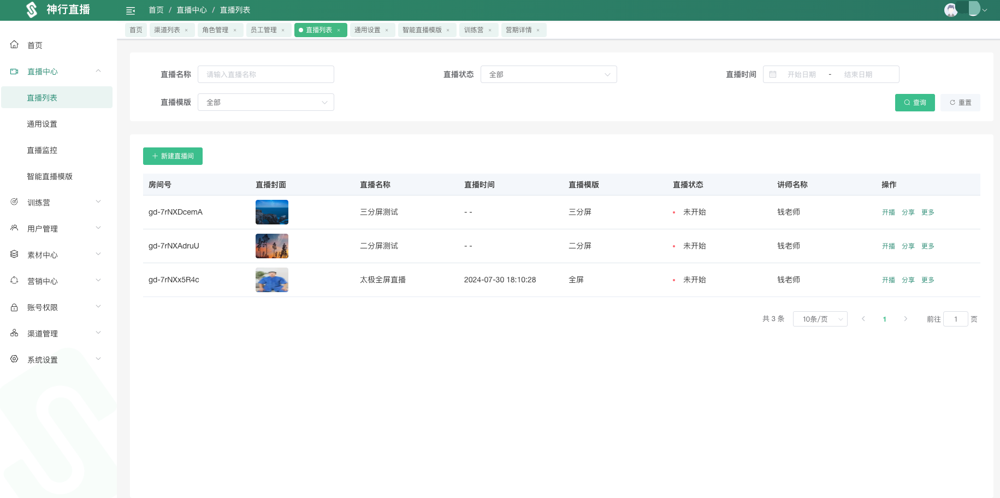
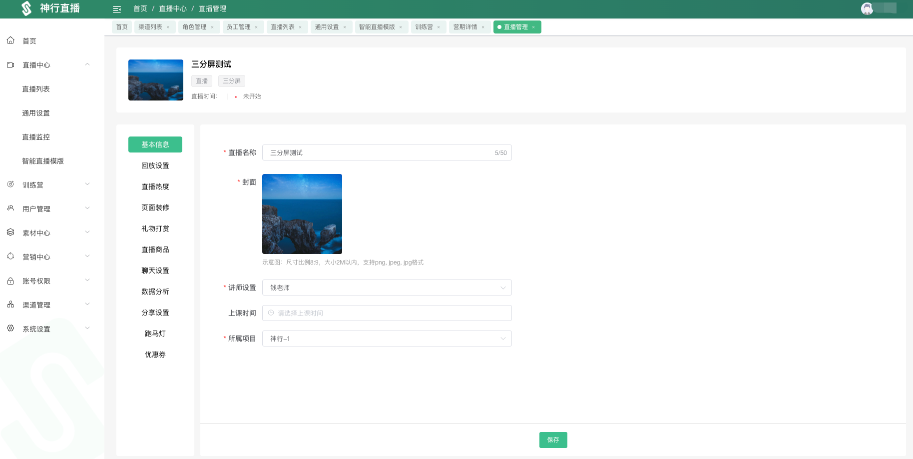
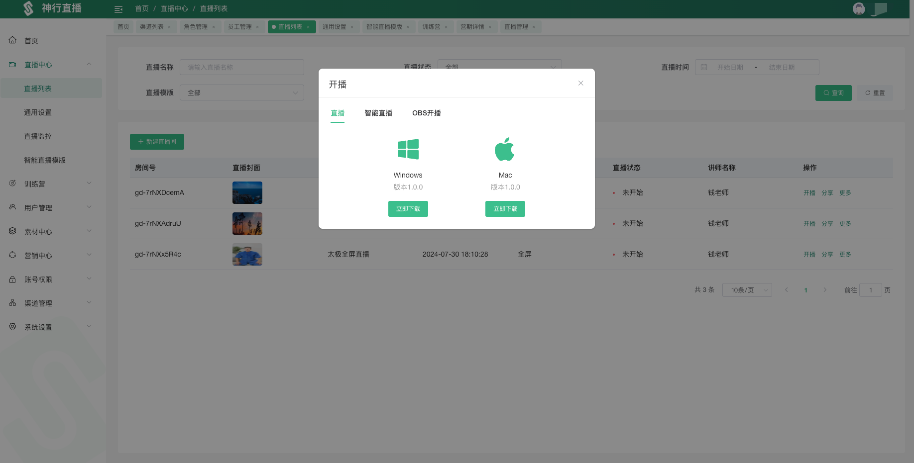
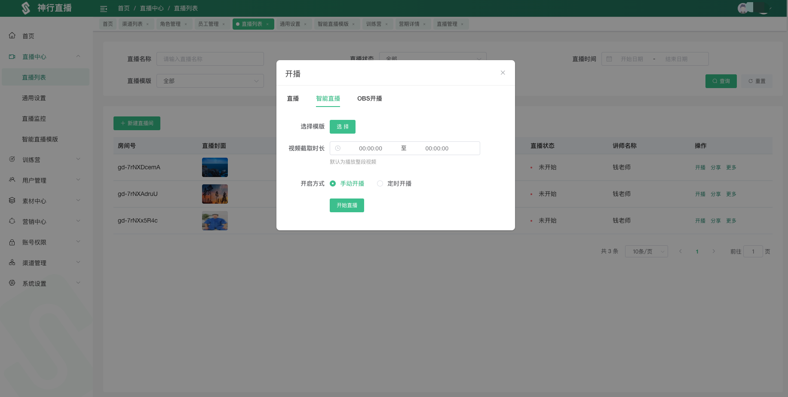
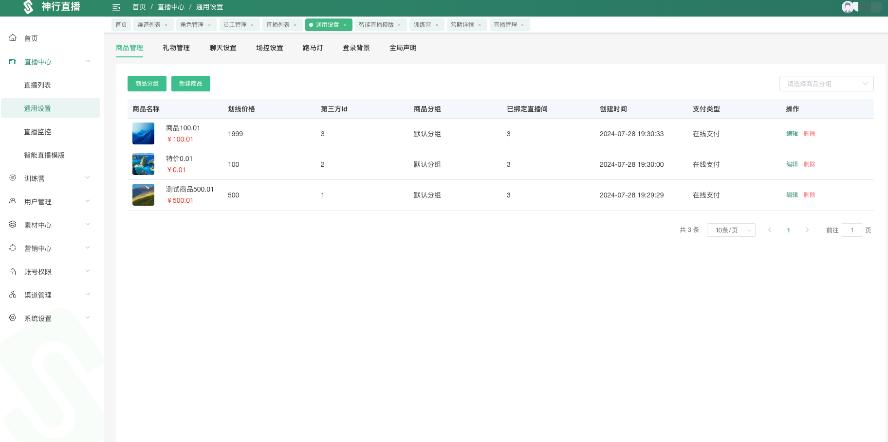
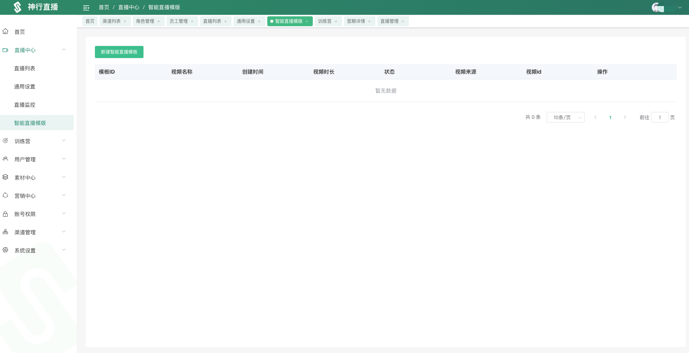
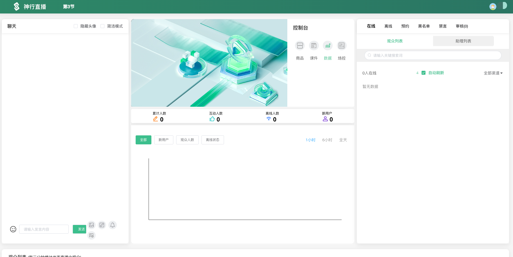
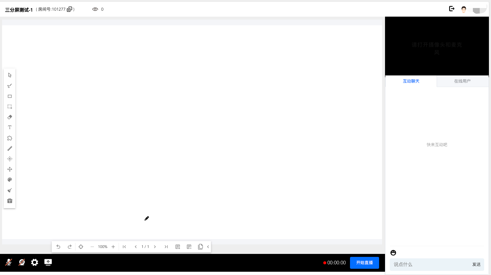
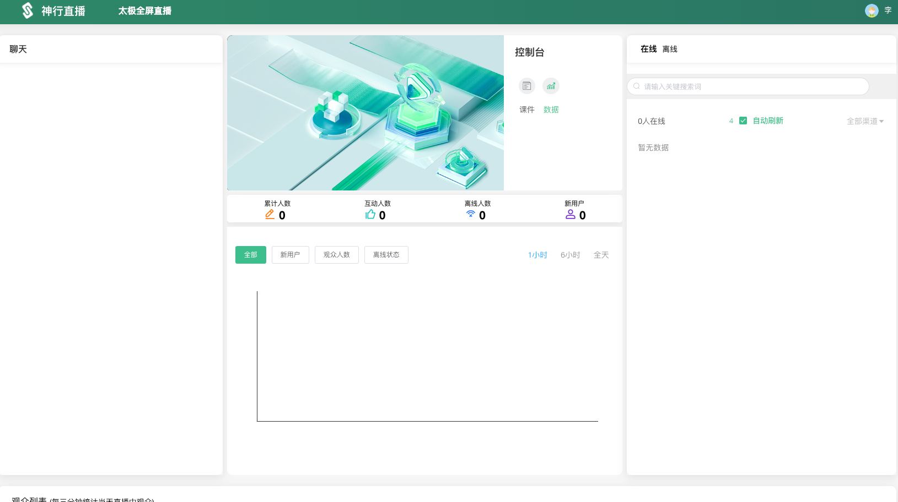

# 私域直播培训平台
## 直播功能: 主播推流,智能直播,OBS推流
## 助理平台: 场控控制,直播间管理,直播间数据统计
## 用户端: 观看直播,聊天互动,礼物打赏
## 直播模板: 三分屏(带课件),二分屏,全屏
## 渠道统计: 渠道推广,渠道统计
## 训练营: 课程管理,课程推广,课程统计,学员导入
### 控制台

### 助理平台

### 主播商

### 渠道页面

### 渠道根据

### 全代码 搭建 联系微信
